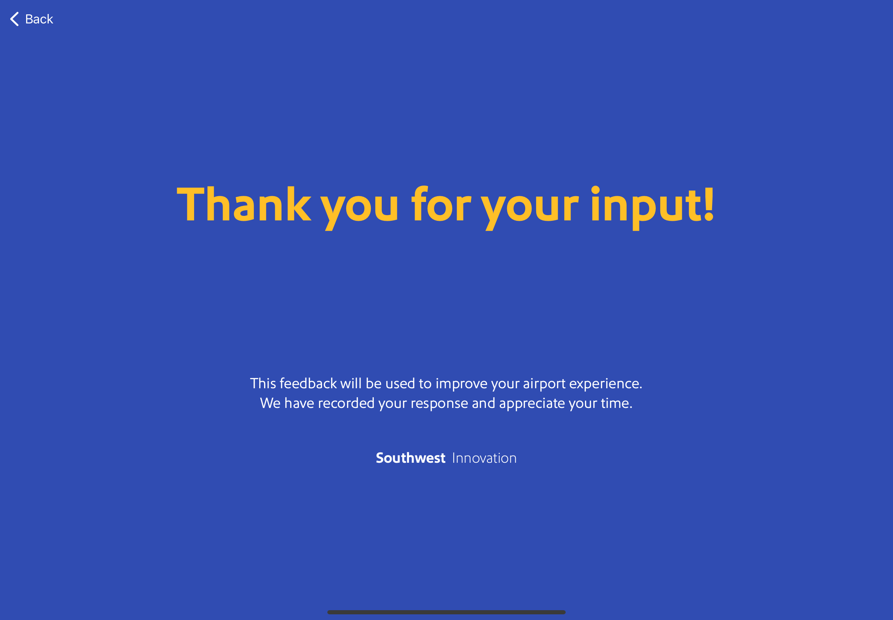
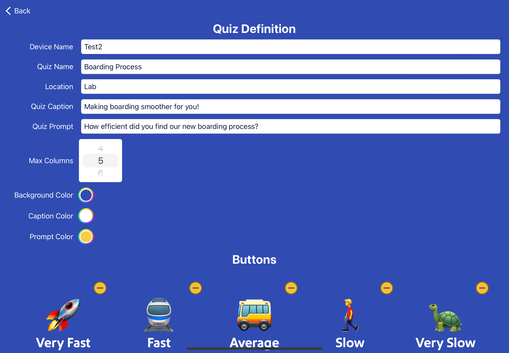
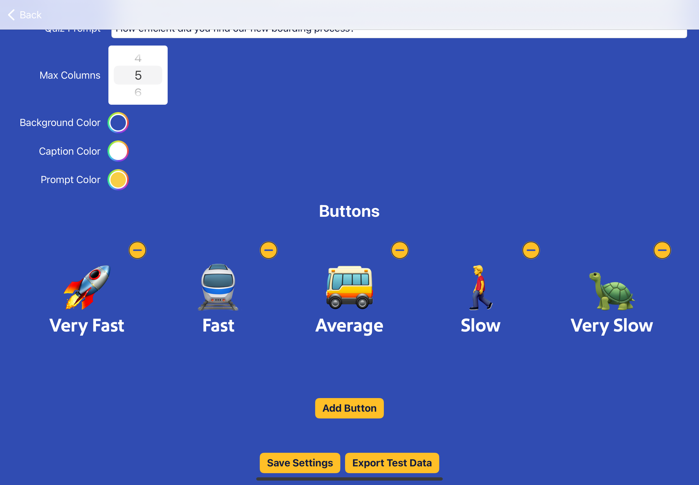
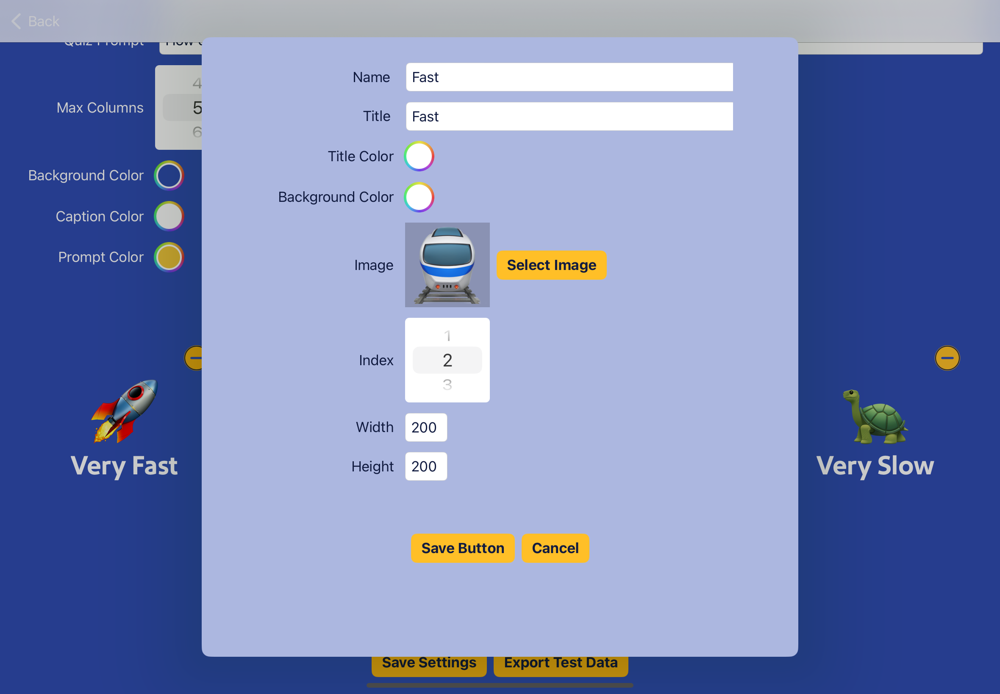

# 😊/😢 GladOrSad-iOS

[](https://opensource.org/licenses/BSD-3-Clause) 

[](https://developer.apple.com)
[](https://developer.apple.com)
[](https://developer.apple.com)

#### Public feedback collection tool for iOS

## 💡 Concept

An intuitive iPad app developed to gather feedback from Customers and provide admin/configuration features.

## 📜 Background

At Southwest's Innovation lab, we often invite our customers and team members to evaluate our user experience concepts - by physically walking through and interacting with a protoype experience. We built a "Glad or Sad" tool to capture real-time feedback during these walkthroughs.

Users are presented with a question and can instantly provide feedback by selecting one of the available buttons.


This first screen is an example of what someone experiencing the walkthrough would see. They are asked a question and then asked to tap one of a series of buttons to submit their feedback. 



Submitting an answer goes to a thank you screen, which will reset to the question again after a few seconds.



The admin screen appears if you tap a number of times on the Southwest Innovation logo. This allows configuring of the question and answer buttons.



The buttons can be changed/removed, new buttons can be added, and the data can be exported.



This is an example screen showing the configuration of an individual button.

## ⚙️ Installation Instructions

If you want to set up an AWS lambda (or other microservice, or REST API) to accept the uploaded results from an iPad, you will need to modify the `EnvironmentService.swift` file.

```
var presignedUrl: String {
        switch environment {
        case .dev, .qa:
            return "REPLACE-WITH-URL/putFile"
        case .prod:
            return "REPLACE-WITH-URL/putFile"
        }
    }
    var apiKey: String {
        switch environment {
        case .dev, .qa:
            return "REPLACE-WITH-API-KEY-TO-AWS"
        case .prod:
            return "REPLACE-WITH-API-KEY-TO-AWS"
        }
    }
```

Do not send this file in a pull request as it will be rejected.

## 🚀 Future ideas

We're always innovating! On our "to do" list are a number of enhancements, such as using drag-and-drop to reorder the buttons, visual representation of aggregated feedback for a more in-depth analysis, QR code scanning for hands-free answering, and a verbal (speech recognition and text to speech) question/response option.

## 💻 Contributors

The following members of Technology Innovation contributed to this project:

|  |
| :---: | 
| Matthew Barkley |
| [](https://www.linkedin.com/in/matthewbarkley/) |

|  |
| :---: | 
| Sierra Dugan |
| [](https://www.linkedin.com/in/sierradugandesign/) |

|  |
| :---: | 
| Michael Roth |
| [](https://www.linkedin.com/in/michael-roth-7106b91/) |

|  |
| :---: | 
| Jeffrey Berthiaume |
| [](https://twitter.com/jeffreality) |
| [](https://linkedin.com/in/jeffreality) |
| [](https://stackoverflow.com/users/71607/jeffrey-berthiaume) |

|  |
| :---: | 
| Ben Smith |
| [](https://linkedin.com/in/benjamin-x-smith-software-eng) |

## 📖 Citations

Reference to cite if needed:

```
@software {
	title = {Glad or Sad},
	author = {Technology Innovation},
	affiliation = {Southwest Airlines},
	url = {https://github.com/SouthwestAir/GladOrSad-iOS},
	month = {10},
	year = {2023},
	license: {BSD-3-Clause}
	version: {1.0}
}

```
